# Commerce

A deliberately small commerce API showing how hexagonal architecture scales beyond a single
feature in Spring Boot. It has four business modules backed by one PostgreSQL database:

- **Customers** registers and queries customers.
- **Catalog** creates, queries, lists, and deactivates products.
- **Inventory** restocks, queries, reserves, and releases stock.
- **Orders** places, queries, lists, confirms, and cancels orders.

The current stack is Java 25, Spring Boot 4.1, Spring Modulith 2.1, PostgreSQL 18, Flyway,
Spring Data JPA, Maven, and Docker Compose.

## Documentation

- [Documentation index](docs/README.md)
- [Architecture and module boundaries](docs/architecture.md)
- [HTTP API reference](docs/api.md)
- [Development, database, and migration guide](docs/development.md)
- [Standalone Mermaid source](docs/diagrams/commerce-hexagonal-architecture.mmd)

## Architecture

The code is package-by-business-capability first. Inside each module, ports belong to the application
core and adapters stay outside it:

```text
com.codillas.academy.commerce
├── CommerceApplication
├── customers
├── catalog
├── inventory
└── orders
    ├── domain                              # framework-free business model and invariants
    ├── application
    │   ├── port
    │   │   ├── in                           # use cases, commands, results, public module contracts
    │   │   └── out                          # interfaces required by application services
    │   └── service                          # use-case implementations and transaction boundaries
    └── adapter
        ├── in
        │   └── web                          # REST controllers, DTOs, and HTTP error mapping
        └── out
            └── persistence                  # JPA implementations of outbound ports
```

The same inner hexagon is repeated within each business module. Spring Modulith publishes each
`application.port.in` package as the named interface `api`, which makes cross-module dependencies
explicit:

```mermaid
flowchart TB
    client["Web / mobile client"]

    subgraph application["Commerce Spring Boot modular monolith"]
        direction TB

        boot["CommerceApplication<br/>@SpringBootApplication · @Modulithic<br/>component scanning · constructor injection<br/>@Bean Clock"]

        subgraph modules["Business modules: package by capability"]
            direction TB

            subgraph customers["customers: no module dependencies"]
                direction LR
                cWeb["adapter.in.web<br/>CustomerController<br/>inbound REST adapter"]
                cApi["application.port.in<br/>CustomerUseCases · CustomerDirectory"]
                cService["application.service<br/>CustomerApplicationService<br/>@Service · @Transactional"]
                cDomain["domain<br/>Customer · framework-free"]
                cRepo["application.port.out<br/>CustomerRepository"]
                cJpa["adapter.out.persistence<br/>JpaCustomerRepositoryAdapter<br/>@Repository"]

                cWeb -->|calls injected port| cApi
                cService -.->|implements inbound port| cApi
                cService -->|uses| cDomain
                cService -->|uses injected outbound port| cRepo
                cJpa -.->|implements outbound port| cRepo
            end

            subgraph catalog["catalog: no module dependencies"]
                direction LR
                pWeb["adapter.in.web<br/>ProductController<br/>inbound REST adapter"]
                pApi["application.port.in<br/>ProductUseCases · ProductCatalog"]
                pService["application.service<br/>ProductApplicationService<br/>@Service · @Transactional"]
                pDomain["domain<br/>Product · framework-free"]
                pRepo["application.port.out<br/>ProductRepository"]
                pJpa["adapter.out.persistence<br/>JpaProductRepositoryAdapter<br/>@Repository"]

                pWeb -->|calls injected port| pApi
                pService -.->|implements inbound port| pApi
                pService -->|uses| pDomain
                pService -->|uses injected outbound port| pRepo
                pJpa -.->|implements outbound port| pRepo
            end

            subgraph inventory["inventory: allowed dependency catalog::api"]
                direction LR
                iWeb["adapter.in.web<br/>InventoryController<br/>inbound REST adapter"]
                iApi["application.port.in<br/>InventoryUseCases · InventoryOperations"]
                iService["application.service<br/>InventoryApplicationService<br/>@Service · @Transactional"]
                iDomain["domain<br/>Stock · framework-free"]
                iRepo["application.port.out<br/>InventoryRepository"]
                iJpa["adapter.out.persistence<br/>JpaInventoryRepositoryAdapter<br/>@Repository · pessimistic stock lock"]

                iWeb -->|calls injected port| iApi
                iService -.->|implements inbound port| iApi
                iService -->|uses| iDomain
                iService -->|uses injected outbound port| iRepo
                iJpa -.->|implements outbound port| iRepo
            end

            subgraph orders["orders: allowed dependencies customers::api, catalog::api, inventory::api"]
                direction LR
                oWeb["adapter.in.web<br/>OrderController<br/>inbound REST adapter"]
                oApi["application.port.in<br/>OrderUseCases"]
                oService["application.service<br/>OrderApplicationService<br/>@Service · @Transactional"]
                oDomain["domain<br/>Order · framework-free state machine"]
                oRepo["application.port.out<br/>OrderRepository"]
                oJpa["adapter.out.persistence<br/>JpaOrderRepositoryAdapter<br/>@Repository · pessimistic lifecycle lock"]

                oWeb -->|calls injected port| oApi
                oService -.->|implements inbound port| oApi
                oService -->|uses| oDomain
                oService -->|uses injected outbound port| oRepo
                oJpa -.->|implements outbound port| oRepo
            end
        end

        iService -->|calls catalog::api| pApi
        oService -->|calls customers::api| cApi
        oService -->|calls catalog::api| pApi
        oService -->|reserves / releases via inventory::api| iApi

    end

    subgraph infrastructure["Infrastructure"]
        direction LR
        compose["Spring Boot Docker Compose support<br/>start-and-stop lifecycle · health check"]
        flyway["Flyway<br/>V1 → V2 → V3 migrations"]
        postgres[("PostgreSQL<br/>customers · products · inventory · orders")]

        compose -->|starts| postgres
        flyway -->|migrates schema| postgres
    end

    subgraph guardrails["Architecture guardrails"]
        direction LR
        modulith["Spring Modulith<br/>application.port.in = named interface api<br/>@ApplicationModule allowedDependencies"]
        moduleTest["ApplicationModules.of<br/>(CommerceApplication.class).verify()"]
        archunit["ArchUnit<br/>application-owned ports · directional adapters<br/>framework isolation · DI through ports"]

        modulith -->|verified by| moduleTest
    end

    client -->|HTTP /api/customers| cWeb
    client -->|HTTP /api/products| pWeb
    client -->|HTTP /api/inventory| iWeb
    client -->|HTTP /api/orders| oWeb

    cJpa -->|JPA / SQL| postgres
    pJpa -->|JPA / SQL| postgres
    iJpa -->|JPA / SQL| postgres
    oJpa -->|JPA / SQL| postgres

    boot -->|development lifecycle| compose
    boot -->|runs at startup| flyway
    application -.->|module graph and public APIs| modulith
    application -.->|internal hexagonal boundaries| archunit

    classDef external fill:#f8fafc,stroke:#64748b,color:#0f172a
    classDef adapter fill:#e0f2fe,stroke:#0284c7,color:#0c4a6e
    classDef port fill:#fef3c7,stroke:#d97706,color:#78350f
    classDef applicationNode fill:#dcfce7,stroke:#16a34a,color:#14532d
    classDef domainNode fill:#ede9fe,stroke:#7c3aed,color:#4c1d95
    classDef springNode fill:#fee2e2,stroke:#dc2626,color:#7f1d1d
    classDef guardrail fill:#ffffff,stroke:#475569,color:#334155,stroke-dasharray:4 3

    class client,postgres external
    class cWeb,cJpa,pWeb,pJpa,iWeb,iJpa,oWeb,oJpa adapter
    class cApi,cRepo,pApi,pRepo,iApi,iRepo,oApi,oRepo port
    class cService,pService,iService,oService applicationNode
    class cDomain,pDomain,iDomain,oDomain domainNode
    class boot,compose,flyway springNode
    class modulith,moduleTest,archunit guardrail
```



The module dependency graph is acyclic:

```text
inventory ──> catalog
orders ─────> customers + catalog + inventory
```

Interfaces under `application.port` are the ports. Application services implement inbound ports and
depend on outbound ports. REST and JPA code live under directional adapter packages. Spring resolves
both bindings through constructor injection. Domain and port types have no Spring or Jakarta
dependencies. Spring annotations stay on services and adapters, where dependency injection and
transaction boundaries are infrastructure concerns.

Order placement validates the customer and active product, then reserves inventory and saves a
price/name snapshot in one database transaction. Inventory uses a pessimistic row lock so two
concurrent orders cannot spend the same stock. Lifecycle changes also lock the order row, so even
concurrent repeated cancellations release stock exactly once.

Spring Modulith owns the module graph: cycles, named-interface access, and declared dependencies.
ArchUnit checks that ports remain application concerns, adapters remain outside the core, dependencies
point inward, frameworks stay in their intended packages, and Spring injects implementations through
port interfaces. It does not duplicate the Modulith checks or freeze class-name suffixes.
See the [architecture guide](docs/architecture.md) for request sequences, transaction boundaries,
data ownership, and the rules for extending a module.

## Requirements

- Java 25
- Maven 3.9+
- Docker with Docker Compose 2.2+

## Run

```bash
cd ~/Desktop/hexagonal-orders
mvn spring-boot:run
```

Spring Boot discovers `compose.yaml`, starts PostgreSQL, waits for its health check, and injects
the connection details. Stopping the JVM stops PostgreSQL; the named volume preserves data.
Flyway owns the schema and Hibernate only validates it.

Docker Compose integration is a development-time dependency, so it is intentionally excluded from
the executable archive. To run the packaged JAR, start the infrastructure explicitly and pass the
discovered random PostgreSQL port:

```bash
mvn clean package
docker compose up -d --wait
commerce_postgres_port=$(docker compose port postgres 5432 | awk -F: '{print $NF}')

SPRING_DATASOURCE_URL="jdbc:postgresql://127.0.0.1:${commerce_postgres_port}/commerce" \
SPRING_DATASOURCE_USERNAME=commerce \
SPRING_DATASOURCE_PASSWORD=commerce \
java -jar target/commerce-0.0.1-SNAPSHOT.jar
```

## Try the workflow

Register a customer:

```bash
curl -i -X POST http://localhost:8080/api/customers \
  -H 'Content-Type: application/json' \
  -d '{"name":"Ada Lovelace","email":"ada@example.com"}'
```

Create a product:

```bash
curl -i -X POST http://localhost:8080/api/products \
  -H 'Content-Type: application/json' \
  -d '{"name":"Mechanical keyboard","price":129.90}'
```

Use the returned IDs to add five units and place an order for two:

```bash
curl -X POST http://localhost:8080/api/inventory/{productId}/restocks \
  -H 'Content-Type: application/json' \
  -d '{"quantity":5}'

curl -i -X POST http://localhost:8080/api/orders \
  -H 'Content-Type: application/json' \
  -d '{"customerId":"{customerId}","productId":"{productId}","quantity":2}'
```

Then inspect or change the order lifecycle:

```bash
curl http://localhost:8080/api/orders/{orderId}
curl -X PUT http://localhost:8080/api/orders/{orderId}/confirmation
curl -X PUT http://localhost:8080/api/orders/{orderId}/cancellation
curl http://localhost:8080/api/inventory/{productId}
```

## HTTP use cases

| Module | HTTP | Endpoint | Use case |
| --- | --- | --- | --- |
| Customers | `POST` | `/api/customers` | Register customer |
| Customers | `GET` | `/api/customers/{id}` | Get customer |
| Customers | `GET` | `/api/customers` | List customers |
| Catalog | `POST` | `/api/products` | Create product |
| Catalog | `GET` | `/api/products/{id}` | Get product |
| Catalog | `GET` | `/api/products` | List products |
| Catalog | `PUT` | `/api/products/{id}/deactivation` | Deactivate product |
| Inventory | `POST` | `/api/inventory/{productId}/restocks` | Add stock |
| Inventory | `GET` | `/api/inventory/{productId}` | Get stock |
| Orders | `POST` | `/api/orders` | Place order and reserve stock |
| Orders | `GET` | `/api/orders/{id}` | Get order |
| Orders | `GET` | `/api/orders` | List orders |
| Orders | `PUT` | `/api/orders/{id}/confirmation` | Confirm order |
| Orders | `PUT` | `/api/orders/{id}/cancellation` | Cancel order and release stock |

Validation and business failures use RFC 9457 problem responses. Examples include `404` for an
unknown resource, `409` for insufficient stock or an invalid state transition, and `422` when an
order references an unknown customer or unavailable product.
The [API reference](docs/api.md) documents all request and response shapes.

## Database and verification

Run PostgreSQL separately when desired:

```bash
docker compose up -d --wait
mvn spring-boot:run
```

Inspect all module tables:

```bash
docker compose exec postgres psql -U commerce -d commerce \
  -c '\dt' \
  -c 'select * from customers;' \
  -c 'select * from products;' \
  -c 'select * from inventory;' \
  -c 'select * from orders;'
```

Run all domain, application, architecture, and module-boundary tests:

```bash
mvn clean verify
```

For migration conventions and both development and packaged-JAR launch modes, see the
[development guide](docs/development.md).

Remove PostgreSQL and its persisted development data:

```bash
docker compose down -v
```
