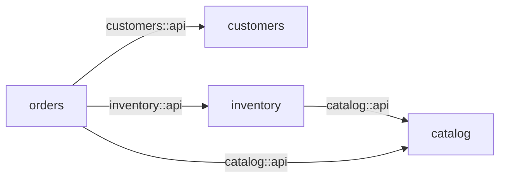
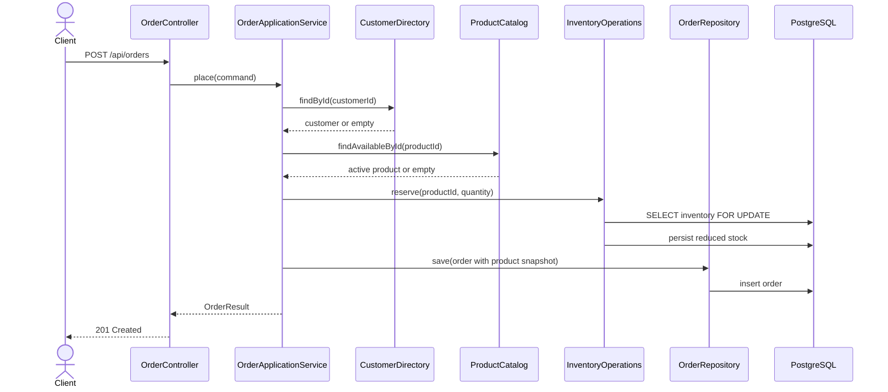
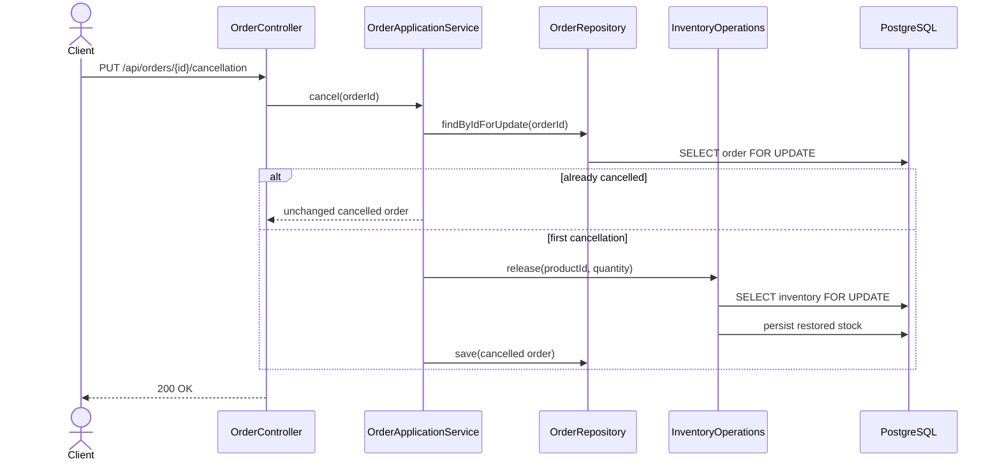

# Architecture

## Purpose and scope

This application is an educational commerce modular monolith. It demonstrates how hexagonal
architecture can be repeated inside business modules without turning every use case into a separate
deployable service.

The implemented scope is intentionally small:

- customers can be registered and queried;
- products can be created, queried, listed, and deactivated;
- inventory can be restocked, queried, reserved, and released;
- orders can be placed, queried, confirmed, and cancelled;
- PostgreSQL is the only external system.

Payment providers, Kafka, external HTTPS adapters, authentication, and distributed transactions are
outside the current scope.

The complete diagram is embedded in the [root README](../README.md#architecture). Its standalone
source is [commerce-hexagonal-architecture.mmd](diagrams/commerce-hexagonal-architecture.mmd).

## Architectural style

The application combines three complementary ideas:

1. **Package by business capability.** The top-level packages are `customers`, `catalog`,
   `inventory`, and `orders`, rather than global `controller`, `service`, and `repository` packages.
2. **Hexagonal internals.** Each module keeps inbound and outbound ports under `application`, puts
   orchestration in `application.service`, keeps the domain framework-free, and places delivery and
   infrastructure code under directional adapters.
3. **A verified modular monolith.** Spring Modulith verifies the module graph and public module APIs.
   ArchUnit verifies each module's internal hexagonal boundaries.

The deployment unit remains one Spring Boot process and one PostgreSQL database.

## Module dependency graph



The graph is acyclic. Cross-module code may only import types from another module's named `api`
interface.

| Module | Responsibility | Public contracts used by other modules | Allowed dependencies |
| --- | --- | --- | --- |
| `customers` | Customer registration and lookup | `CustomerDirectory`, `CustomerResult` | None |
| `catalog` | Product lifecycle and active-product lookup | `ProductCatalog`, `ProductResult` | None |
| `inventory` | Stock restocking, reservation, and release | `InventoryOperations`, inventory result/errors | `catalog::api` |
| `orders` | Order workflow and price/name snapshots | Order use-case ports | `customers::api`, `catalog::api`, `inventory::api` |

Each module exposes `application.port.in` with `@NamedInterface("api")`. The package name states who
owns the ports; the named-interface alias controls what other modules may import.

## Anatomy of a module

```text
<module>
├── domain                              framework-free business state and invariants
├── application
│   ├── port
│   │   ├── in                           use cases, commands, results, public module contracts
│   │   └── out                          interfaces required by application services
│   └── service                          use-case implementations and transaction boundaries
└── adapter
    ├── in
    │   └── web                          REST controllers, request/response DTOs, HTTP error mapping
    └── out
        └── persistence                  JPA entities and outbound-port implementations
```

### Dependency rule

- Domain classes contain no Spring, Jakarta Persistence, HTTP, or adapter dependencies.
- Inbound and outbound ports are application concerns and contain no Spring, Jakarta, service, or
  adapter dependencies.
- The `application.port.in` package contains the module's published contract. Its package descriptor
  supplies the Spring Modulith `@NamedInterface("api")` alias.
- Application services implement inbound ports and depend on domain types, outbound ports, and
  explicitly allowed inbound ports from other modules.
- Inbound adapters invoke inbound ports rather than concrete services.
- Outbound adapters implement outbound ports.
- Adapters never call each other directly.

These rules keep the business model testable without a Spring context while still allowing pragmatic
Spring annotations on application services.

## Dependency injection

Interfaces are the ports and Spring's application context is the composition mechanism:

```text
adapter.in.web controller
    └── constructor(application.port.in interface)
            └── application.service implementation
                    └── constructor(application.port.out interface)
                            └── adapter.out.persistence implementation
```

Application services use `@Service`; persistence adapters use `@Repository`; REST adapters use
`@RestController`. Spring resolves each constructor dependency by interface type. No service locator
or manual lookup is used.

`CommerceApplication` also provides a UTC `Clock` bean. Time-dependent application behavior accepts
that JDK interface, which makes domain and application tests deterministic.

## Main workflows

### Place an order



The order stores `productName` and `unitPrice` snapshots. Later catalog changes therefore do not
rewrite the commercial facts of an existing order.

### Cancel an order



Locking the order row makes repeated concurrent cancellation requests idempotent and prevents stock
from being released twice.

## Transactions and concurrency

- Write use cases are annotated with `@Transactional` at the application-service boundary.
- Order placement joins customer/product validation, inventory reservation, and order persistence in
  one local database transaction.
- Inventory reservation and release take a pessimistic write lock on the product's inventory row to
  prevent overselling.
- Confirmation and cancellation take a pessimistic write lock on the order row to serialize lifecycle
  transitions.
- Read use cases inherit `@Transactional(readOnly = true)` from their application service.
- Hibernate schema generation is disabled with `ddl-auto: validate`; Liquibase alone changes the schema.

This design relies on all modules sharing one database transaction manager. If a module moves to a
separate process or database, these synchronous contracts and transaction assumptions must be
redesigned, typically around messages and explicit consistency boundaries.

## Persistence and data ownership

Each module owns its table and persistence adapter:

| Module | Table | Aggregate identifier |
| --- | --- | --- |
| `customers` | `customers` | Customer UUID |
| `catalog` | `products` | Product UUID |
| `inventory` | `inventory` | Product UUID |
| `orders` | `orders` | Order UUID |

JPA entities store UUID references rather than navigating cross-module entity relationships. Database
foreign keys preserve referential integrity without coupling one module's domain model to another
module's JPA entity.

## Automated guardrails

`ModularityTests` calls:

```java
ApplicationModules.of(CommerceApplication.class).verify();
```

This test verifies the module graph: cycles, access through named interfaces, and declared allowed
dependencies.

`HexagonalArchitectureTests` owns the rules inside each module:

- the explicit domain, application-port, application-service, and directional-adapter package shape;
- inward-only dependencies between inbound adapters, ports, services, domain, and outbound adapters;
- framework-free domain and application ports;
- Spring MVC/Validation confined to `adapter.in.web` and Spring Data/JPA confined to
  `adapter.out.persistence`;
- controller injection through inbound ports rather than concrete services;
- application services implementing inbound ports and persistence adapters implementing outbound
  ports.

ArchUnit does not enforce class-name conventions or repeat the module checks already performed by
Spring Modulith. Failures therefore point to architectural boundaries rather than style preferences.

Run both guardrails with the rest of the test suite:

```bash
mvn clean verify
```

## Extending the application

When adding behavior:

1. Choose the business module that owns the behavior.
2. Extend the module's cohesive `*UseCases` interface under `application.port.in`, or add a narrow
   inbound port when another module needs a smaller contract.
3. Put business invariants in `domain` and orchestration in `application.service`.
4. Put interfaces for required external capabilities under `application.port.out`.
5. Implement HTTP delivery under `adapter.in.web` and persistence under
   `adapter.out.persistence`.
6. If another module must call the new inbound port, expose it through the named interface `api` and
   update the caller's `allowedDependencies` declaration.
7. Add and include a new Liquibase changeset rather than editing one that has already run.
8. Add domain/application tests and run the architecture verification.

Do not import another module's domain, service, outbound port, or adapter packages. Cross-module
imports must target its published `application.port.in` contract. If that creates a cycle, revisit
module ownership before adding the dependency.
