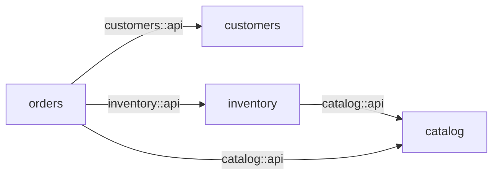
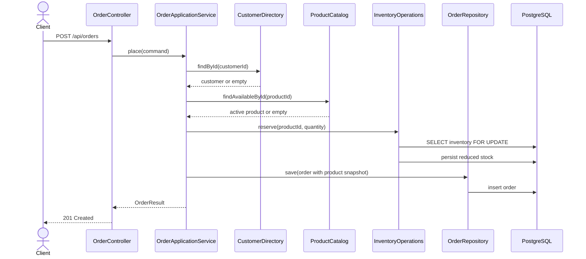
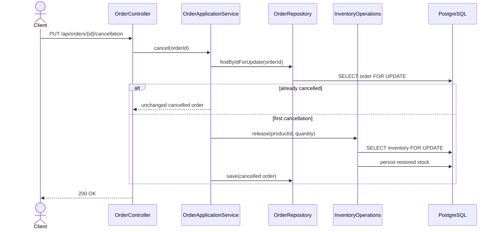

# Architecture

## Purpose and scope

This application is an educational commerce modular monolith. It demonstrates how hexagonal
architecture can be repeated inside business modules without turning every use case into a separate
deployable service.

The implemented scope is intentionally small:

- customers can be registered and queried;
- products can be created, queried, listed, and deactivated;
- inventory can be restocked, queried, reserved, and released;
- orders can be placed, queried, confirmed, and cancelled;
- PostgreSQL is the only external system.

Payment providers, Kafka, external HTTPS adapters, authentication, and distributed transactions are
outside the current scope.

The complete diagram is embedded in the [root README](../README.md#architecture). Its standalone
source is [commerce-hexagonal-architecture.mmd](diagrams/commerce-hexagonal-architecture.mmd).

## Architectural style

The application combines three complementary ideas:

1. **Package by business capability.** The top-level packages are `customers`, `catalog`,
   `inventory`, and `orders`, rather than global `controller`, `service`, and `repository` packages.
2. **Hexagonal internals.** Each module contains public API ports, a framework-free domain,
   application orchestration, and web/persistence adapters.
3. **A verified modular monolith.** Spring Modulith declares allowed dependencies and exposed named
   interfaces. ArchUnit verifies the inward dependency rule.

The deployment unit remains one Spring Boot process and one PostgreSQL database.

## Module dependency graph



The graph is deliberately acyclic. Cross-module code may only import types from another module's
named `api` interface.

| Module | Responsibility | Public contracts used by other modules | Allowed dependencies |
| --- | --- | --- | --- |
| `customers` | Customer registration and lookup | `CustomerDirectory`, `CustomerResult` | None |
| `catalog` | Product lifecycle and active-product lookup | `ProductCatalog`, `ProductResult` | None |
| `inventory` | Stock restocking, reservation, and release | `InventoryOperations`, inventory result/errors | `catalog::api` |
| `orders` | Order workflow and price/name snapshots | Order use-case ports | `customers::api`, `catalog::api`, `inventory::api` |

The declarations live in each module's `package-info.java`. Public API packages are exposed with
`@NamedInterface("api")`.

## Anatomy of a module

```text
<module>
├── api                         cohesive use-case ports and cross-module contracts
├── domain                      framework-free business state and invariants
├── application                 services, repository ports, and application failures
└── adapter
    ├── web                     REST controllers, request/response DTOs, HTTP error mapping
    └── persistence             JPA entities and repository-port implementations
```

### Dependency rule

- Domain classes contain no Spring, Jakarta Persistence, HTTP, or adapter dependencies.
- Public API types contain no Spring or Jakarta dependencies. The package descriptor alone carries
  the Spring Modulith `@NamedInterface` annotation.
- Application services depend on domain types, repository ports, and explicitly allowed module APIs.
- Inbound adapters invoke use-case interfaces, not concrete services.
- Persistence adapters implement outbound repository interfaces.
- Web adapters never call persistence adapters directly.

These rules keep the business model testable without a Spring context while still allowing pragmatic
Spring annotations on application services.

## Dependency injection

Interfaces are the ports and Spring's application context is the composition mechanism:

```text
REST controller
    └── constructor(inbound use-case interface)
            └── application service implements interface
                    └── constructor(outbound repository interface)
                            └── JPA adapter implements interface
```

Application services use `@Service`; persistence adapters use `@Repository`; REST adapters use
`@RestController`. Spring resolves each constructor dependency by interface type. No service locator
or manual lookup is used.

`CommerceApplication` also provides a UTC `Clock` bean. Time-dependent application behavior accepts
that JDK interface, which makes domain and application tests deterministic.

## Main workflows

### Place an order



The order stores `productName` and `unitPrice` snapshots. Later catalog changes therefore do not
rewrite the commercial facts of an existing order.

### Cancel an order



Locking the order row makes repeated concurrent cancellation requests idempotent and prevents stock
from being released twice.

## Transactions and concurrency

- Write use cases are annotated with `@Transactional` at the application-service boundary.
- Order placement joins customer/product validation, inventory reservation, and order persistence in
  one local database transaction.
- Inventory reservation and release take a pessimistic write lock on the product's inventory row to
  prevent overselling.
- Confirmation and cancellation take a pessimistic write lock on the order row to serialize lifecycle
  transitions.
- Read use cases inherit `@Transactional(readOnly = true)` from their application service.
- Hibernate schema generation is disabled with `ddl-auto: validate`; Flyway alone changes the schema.

This design relies on all modules sharing one database transaction manager. If a module moves to a
separate process or database, these synchronous contracts and transaction assumptions must be
redesigned, typically around messages and explicit consistency boundaries.

## Persistence and data ownership

Each module owns its table and persistence adapter:

| Module | Table | Aggregate identifier |
| --- | --- | --- |
| `customers` | `customers` | Customer UUID |
| `catalog` | `products` | Product UUID |
| `inventory` | `inventory` | Product UUID |
| `orders` | `orders` | Order UUID |

JPA entities store UUID references rather than navigating cross-module entity relationships. Database
foreign keys preserve referential integrity without coupling one module's domain model to another
module's JPA entity.

## Automated guardrails

`ModularityTests` calls:

```java
ApplicationModules.of(CommerceApplication.class).verify();
```

This verifies cycles, named-interface access, and declared allowed dependencies.
`HexagonalArchitectureTests` adds executable rules for:

- the exact five-package module template;
- inward-only dependencies between API, domain, application, web, and persistence;
- framework-free domain and public API types;
- keeping Spring MVC/Validation and Spring Data/JPA in their respective adapters;
- controller injection through API interfaces rather than concrete services;
- application-service and persistence-adapter implementation of their ports;
- consistent placement and naming for controllers, exception handlers, services, ports, JPA
  entities, Spring Data repositories, and repository adapters;
- protection of every module's domain, application, and adapters from cross-module imports.

Run both guardrails with the rest of the test suite:

```bash
mvn clean verify
```

## Extending the application

When adding behavior:

1. Choose the business module that owns the behavior.
2. Extend the module's cohesive `*UseCases` interface, or add a narrow cross-module interface under
   `api` when callers need a smaller contract.
3. Put business invariants in the domain and orchestration in an application service.
4. Introduce an outbound port only when the application core needs an external capability.
5. Implement infrastructure details under `adapter.persistence`; keep HTTP details under
   `adapter.web`.
6. If another module must call the new contract, expose it through the named API and update the
   caller's `allowedDependencies` declaration.
7. Add a new Flyway migration rather than editing an applied migration.
8. Add domain/application tests and run the architecture verification.

Do not import another module's domain, application, or adapter packages. If an interaction cannot be
expressed through a narrow public contract without creating a cycle, revisit module ownership before
adding the dependency.
